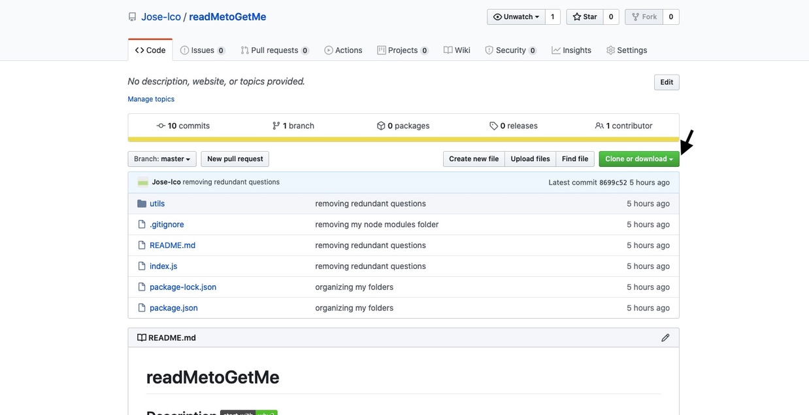

# Eat_Da_Burger
## Description [](http://www.ted.com/talks/simon_sinek_how_great_leaders_inspire_action)

AS a restaurant owner I would like when a customer decides to eat at my restaurant, or when an employee takes an order for a burger they are able to keep track of orders in the restaurant which makes it better for them hence I created a burger app that facilitates this process.

## Table of Contents

* [Installation](#installation)
* [Usage](#usage)
* [Contributing](#contributing)

## Technologies used

* Javascript
* Node.js
* mysql
* Express
* Express Handlebars
* HTML
* CSS

## Installation

1. The first step would be to clone the link of the repository. This can be done by clicking the green button on the top right of this repository.


2. Go to your terminal on your computer and run this command in the folder that you would like to generate the README.
```bash
git clone https://github.com/Jose-lco/Eat_Da_Burger.git
```
3. Open the folder with the repository. The first thing you would do is to install the dependencies. In order to do this, you would run npm install in the command line.
```
npm install 
``` 
4. To officially run the application, run this in the command line:
```bash
node server.js
```
## Usage

This is a restaurant app that lets users input the names of burgers they'd like to eat. Whenever a user submits a burger's name, your app will display the burger on the left side of the page -- waiting to be devoured. Each burger in the waiting area also has a `Devour it!` button. When the user clicks it, the burger will move to the right side of the page. Your app will store every burger in a database, whether devoured or not.

 

## Contributing [](https://github.com/Jose-lco/undefined/issues)

yes you can make contributions to this project and report any issues. If you would like to make a contribution to the application, the green badge above will direct you to the issues page for this repository and you can submit your issue there.

## License

This project is licensed under ISC

## Acknowledgements
I used this repository to learn about badges: 
[dwyl repo-badges](https://github.com/dwyl/repo-badges)

## Authors

**This project was created by:**
* Jose-lco [](http://hits.dwyl.com/Jose-lco/Eat_Da_Burger)
  * Contact info: [Linkedin profile](www.linkedin.com/in/josephine-ndungu-a0a441160)
